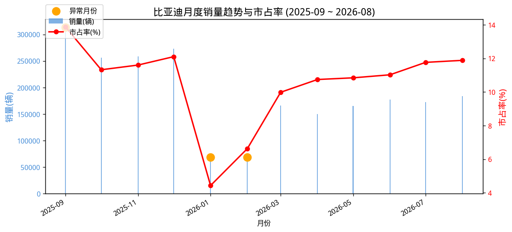
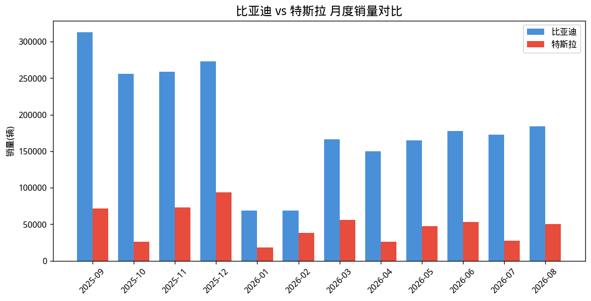
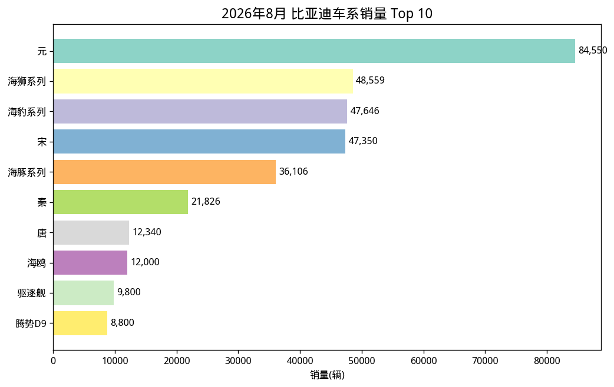
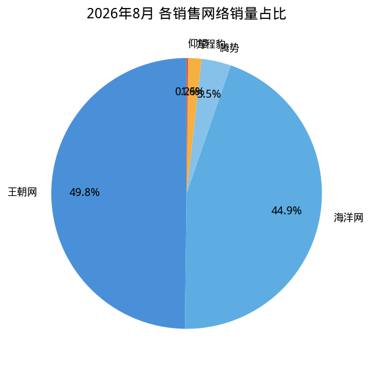
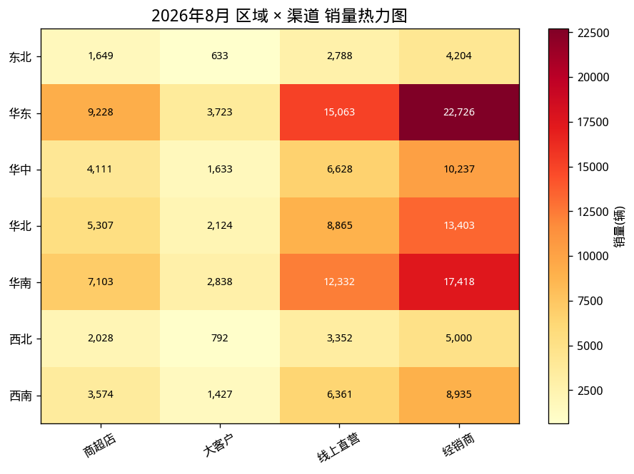
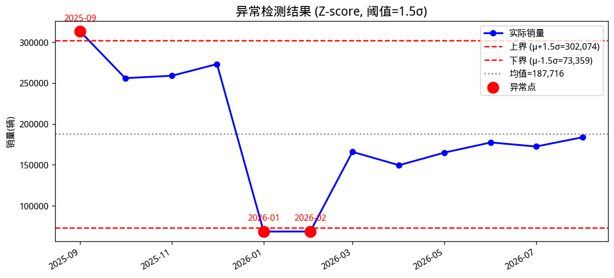
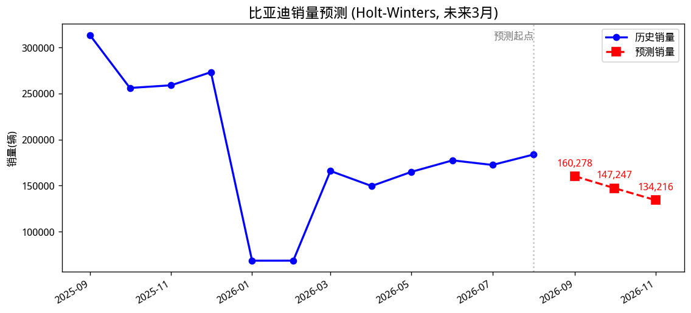

# 🚗 数据智能分析引擎 (Data Intelligence Analyst Kit)

> 面向数据科学 / AI 分析岗位的全链路工具集，覆盖 **数据建模 · 异常检测 · 智能归因 · LLM Agent** 四大核心能力。

本项目旨在用数据驱动的方式辅助业务决策，支撑商务和运营决策。

## ✨ 核心能力

| JD 职责 | 模块 | 技术实现 |
|---------|------|---------|
| **1. 数据建模** | `src/modeling/` | 时序预测（ARIMA/Holt-Winters/Prophet）、回归评估（Linear/RF/XGBoost）、聚类分群 |
| **2. 异常检测** | `src/anomaly/` | 统计方法（3σ/IQR/Z-score/ESD）、机器学习（Isolation Forest/OCSVM/XGBoost）、时序检测（滚动/STL/CUSUM） |
| **3. 智能归因** | `src/attribution/` | 多维下钻、贡献度分解（加性/Shapley）、假设检验（t/Mann-Whitney/卡方/KS）、**因果推断**（Granger/DoWhy） |
| **4. AI 探索** | `src/llm_agent/` | 可插拔 LLM 接口、自动报告生成、端到端 Agent 编排 |

## 📊 比亚迪销量数据分析报告

> 数据来源：火山引擎「专业数据集」· 统计周期：2025-09 ~ 2026-08 · 完整报告见 [reports/byd_sales_analysis_report.html](reports/byd_sales_analysis_report.html)

### 核心指标概览

| 指标 | 数值 |
|------|------|
| 2026年8月销量 | **183,789** 辆 |
| 环比增长 | **+6.6%** |
| 12个月累计 | **2,252,593** 辆 |
| 平均市占率 | **10.5%** |

### 1. 销量趋势分析

比亚迪销量在 2025-09 达到峰值 31.3 万辆后，2026-01 因春节效应断崖下跌至 6.9 万辆，随后逐月回升，8月恢复至 18.4 万辆。市占率从年初 4.4% 回升至 8 月 11.9%，稳居行业第一。



### 2. 竞品对比（比亚迪 vs 特斯拉）

比亚迪销量平均为特斯拉的 **4.3 倍**，且走势更稳健；特斯拉波动更大（单月峰值 9.4 万 vs 谷值 1.8 万）。两者均在 2026-01 出现低谷，但比亚迪恢复速度更快。



### 3. 车系结构分析（2026年8月）

销量 Top 3 车系：**元(84,550)**、**海狮系列(48,559)**、**海豹系列(47,646)**。海洋网与王朝网双轮驱动，经销商渠道为增量核心来源。





### 4. 多维归因（区域 × 渠道）

8月增量主要由 **海狮06(19.6%)** 和 **秦PLUS(18.9%)** 拉动；华东、华南区域贡献最大，经销商渠道占比最高。Mann-Whitney U 检验显示 7月 vs 8月细分销量存在显著差异。



### 5. 异常检测

采用 Z-score(阈值1.5σ) + 滚动时序组合检测，共检出 **3 个异常月份**：2025-09（高基数峰值）、2026-01/02（春节低谷）。建议将春节月纳入专用规则，减少误报。



### 6. 销量预测

基于 Holt-Winters 指数平滑模型预测未来 3 月销量，9-11月目标可设定在 18-20 万辆区间，同时关注"金九银十"旺季的季节性冲高。



### 结论与建议

1. **市场地位稳固**：连续多月市占率第一，8月达 11.9%，领先特斯拉明显。
2. **异常需规则化**：春节月（1-2月）销量异常属季节性规律，建议在异常检测系统中加入"春节效应"日历特征。
3. **增量来源清晰**：8月增长由王朝网（元、宋）和海洋网（海狮、海豹）双轮驱动，经销商渠道贡献最大。
4. **目标设定建议**：基于预测，9-11月目标设定在 18-20 万辆区间。

---

## 📦 项目结构

```
data-intelligence-analyst-kit/
├── src/
│   ├── modeling/          # 数据建模：时序预测 / 回归 / 聚类
│   ├── anomaly/           # 异常检测：统计 / ML / 时序
│   ├── attribution/       # 智能归因：下钻 / 贡献度 / 假设检验 / 因果推断
│   ├── llm_agent/         # LLM Agent：可插拔接口 / 报告 / 编排
│   ├── dashboard/         # Streamlit 可视化看板
│   └── utils/             # 数据加载与工具
├── notebooks/             # 7 个演示 Notebook
├── tests/                 # 单元测试（27 tests）
├── .trae/skills/          # TRAE 自定义 Skill
├── configs/               # 配置文件
├── data/                  # 数据目录
└── scripts/               # 辅助脚本
```

## 🚀 快速开始

### 安装

```bash
git clone <your-repo-url>
cd data-intelligence-analyst-kit
pip install -e ".[all]"
```

### 一键体验

```python
import sys; sys.path.insert(0, 'src')
from utils.data_loader import prepare_all
from llm_agent import AnalysisAgent

# 加载真实数据（比亚迪/特斯拉销量）
datasets = prepare_all()

# 端到端分析 Agent
md = datasets['multi_dim_sales'].copy()
md['period'] = md['month'].dt.strftime('%Y-%m')
agent = AnalysisAgent(df=md, metric_col='sales', period_col='period', time_col='month')
report = agent.run_all()
print(report)
```

### 启动可视化看板

```bash
streamlit run src/dashboard/app.py
```

## 🔧 通用数据分析（支持任意数据源）

项目核心分析引擎**与具体业务解耦**，可用于任意类型的数据分析。只需一行命令，自动完成 **数据获取 → 探索 → 异常检测 → 归因 → 预测 → 报告**。

### 方式一：从本地 CSV 分析

```bash
# 自动推断指标列/时间列/维度列
python scripts/run_analysis.py --csv your_data.csv

# 或手动指定
python scripts/run_analysis.py --csv your_data.csv --metric 销售额 --time 日期 --dims 产品,地区
```

### 方式二：从火山引擎专业数据集检索并分析

```bash
export PRO_DATASET_API_KEY=hqd_sk_xxx

# 任意查询语句，支持汽车/股票/宏观/工商/学术等领域
python scripts/run_analysis.py --query "贵州茅台 近一年股价" --metric 收盘价 --time 日期
python scripts/run_analysis.py --query "2026年8月中国新能源汽车销量" --metric value --time time_raw
python scripts/run_analysis.py --query "比亚迪 分车系销量" --metric 销量 --time 月份 --dims 车系,网络
```

### 输出内容

每个分析任务会在输出目录生成：

| 文件 | 内容 |
|------|------|
| `trend.png` | 指标趋势图 |
| `anomaly.png` | 异常检测结果（Z-score） |
| `dimension.png` | 维度分布 Top 10 |
| `forecast.png` | 未来 3 期预测（Holt-Winters） |
| `report.md` | 综合分析报告 |

> 专业数据集覆盖：汽车销量、股票金融、宏观经济、企业工商、企业风险、学术文献等领域。

## 📊 数据源

项目内置来自 **火山引擎「专业数据集」** 的真实业务数据：

- 比亚迪、特斯拉近一年全国月度销量
- 比亚迪分车系/网络销量
- 多维增强数据（车型 × 区域 × 渠道）用于归因分析演示
- 日级销量时序（含节假日/周末效应）用于异常检测

### 获取最新数据（在线模式）

项目提供 `ProDatasetClient` Python 客户端，可在 Notebook/脚本中直接调用专业数据集 API：

```python
from utils import ProDatasetClient

client = ProDatasetClient(api_key="hqd_sk_xxx")  # 或设置 PRO_DATASET_API_KEY
result = client.search("比亚迪 近一年全国销量趋势")
print(result.to_dataframe())
```

Notebook `07_pro_dataset_end_to_end.ipynb` 支持**在线/离线双模式**：
- 有 `PRO_DATASET_API_KEY` 环境变量 → 在线调用真实 API
- 无 Key → 自动回退到 `data/raw/cached_responses/` 中的缓存 JSON（已包含真实数据）

## 📚 Notebooks 演示

| Notebook | 内容 |
|----------|------|
| [01_data_exploration.ipynb](notebooks/01_data_exploration.ipynb) | 数据探索与可视化 |
| [02_data_modeling.ipynb](notebooks/02_data_modeling.ipynb) | 时序预测 / 回归评估 / 聚类分群 |
| [03_anomaly_detection.ipynb](notebooks/03_anomaly_detection.ipynb) | 统计 + ML + 时序异常检测 |
| [04_attribution_analysis.ipynb](notebooks/04_attribution_analysis.ipynb) | 多维下钻 / 贡献度分解 / 假设检验 |
| [05_causal_inference.ipynb](notebooks/05_causal_inference.ipynb) | Granger / DoWhy 因果推断 |
| [06_llm_agent_report.ipynb](notebooks/06_llm_agent_report.ipynb) | LLM 接口 / 自动报告 / Agent |
| [07_pro_dataset_end_to_end.ipynb](notebooks/07_pro_dataset_end_to_end.ipynb) | 火山引擎专业数据集端到端 |

## 🧪 测试

```bash
pytest tests/ -v
```

## 🔌 LLM 接入

项目采用**可插拔 LLM 接口**设计，支持 Mock 模式（无需 API Key）和真实模型：

```python
from llm_agent import get_provider

# Mock 模式（离线演示）
llm = get_provider('mock')

# 真实 LLM（设置环境变量）
import os
os.environ['OPENAI_API_KEY'] = 'your-key'
llm = get_provider('openai', model='gpt-4o-mini')
```

## 🤖 TRAE Skill

项目内置 TRAE 自定义 Skill：`.trae/skills/data-intelligence-analyst/SKILL.md`，封装了完整的数据分析工作流，可在 TRAE 中直接调用。

## 📄 License

MIT License

---

> 本项目为数据科学/AI 分析岗位能力展示作品集，所有真实数据来自火山引擎「专业数据集」，分析结论仅供演示。
